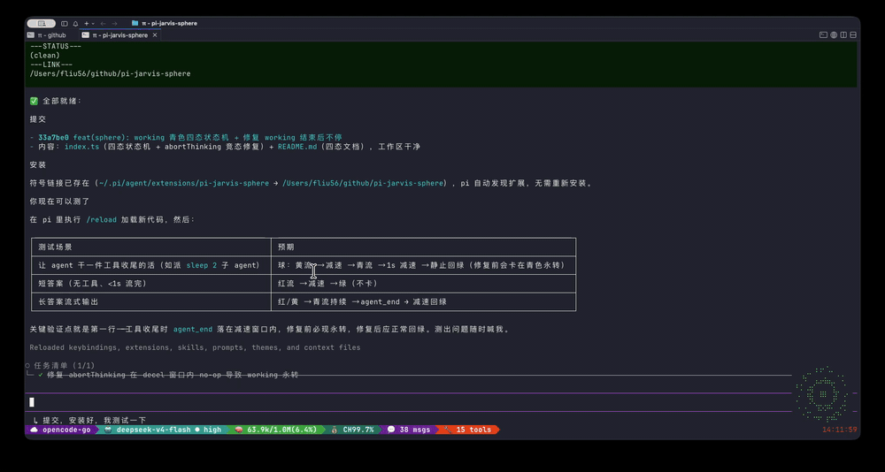

# pi-jarvis-sphere 🜄

[English](README.md) | [中文](README.zh.md)

**Jarvis particle sphere for the [pi](https://github.com/earendil-works/pi-coding-agent) agent** — a particle-sphere overlay floating in the bottom-right corner of your pi terminal. It shifts color and animation with pi's live state — red counter-clockwise ring while thinking, yellow clockwise ring during tool calls, cyan clockwise ring while streaming the answer, and a denser pulse while TTS speaks — like a little assistant that's alive.



## ✨ Features

- **Four-state animation**, color = state:
  | State | Color | Animation |
  |---|---|---|
  | Idle | green `#00e676` | center water ripple (wavefronts expanding outward) + particle halo breathing |
  | Thinking | red `#ff3d00` | uniform particle ring, **counter-clockwise** (3 layers × 16 dots, differential rotation: inner slower, outer faster) |
  | Tool call | yellow `#ffeb3b` | uniform particle ring, **clockwise** |
  | Working (streaming answer) | cyan `#00E5FF` | uniform particle ring, **clockwise** (while the model streams its answer) |
  | Wind-down | keeps current color | 1-second deceleration after thinking/tool/working ends, then back to idle |
- **TTS sync**: when [pi-ext-tts-mimo](https://github.com/fan56/pi-jarvis-sphere) plays speech, the sphere pulses denser and faster, as if talking (idle 10 FPS → 30 FPS while speaking).
- **Direction anchor**: the ring has a gap so the rotation direction is unmistakable at a glance.
- **Non-intrusive**: a `nonCapturing` overlay — typing and keybindings are completely unaffected.
- **Toggleable**: `/jarvis` toggles it on/off, persisted to `config.json` (on by default).
- **Lifecycle-safe**: mounts on `session_start`, cleans up on `session_shutdown`; sub-agent sessions don't double-mount; `/reload` doesn't leak listeners.

## 📦 Installation

```bash
# 1. Clone into its own directory (same convention as other ~/github pi extensions)
git clone https://github.com/fan56/pi-jarvis-sphere.git ~/github/pi-jarvis-sphere

# 2. Symlink into pi's extension dir (pi auto-discovers ~/.pi/agent/extensions/<name>)
ln -s ~/github/pi-jarvis-sphere ~/.pi/agent/extensions/pi-jarvis-sphere

# 3. /reload inside pi — done
```

> Optional dependency: `pi-ext-tts-mimo` provides the `tts:started` / `tts:stopped` signals so the sphere can react to speech. Without it the sphere still works — just no talking pulse.

## 🎮 Usage

| Command | Effect |
|---|---|
| `/jarvis` | Toggle the sphere on/off (state written to `config.json`) |

`config.json` (in the extension dir, default):

```json
{ "enabled": true }
```

## 🧪 Development & Debugging

- After editing, `/reload` in pi hot-reloads (jiti runs `.ts` directly — no build step).
- Syntax check: `node -e "…typescript.transpileModule…"` (no tsc build).
- To test: dispatch a `sleep N` sub-agent to observe the tool state (yellow · clockwise); a normal Q&A to observe the think state (red · counter-clockwise).

## 🗺️ Roadmap

- [ ] V2: standalone external window (extension spins up a local WebSocket + browser, real 3D WebGL particle sphere)
- [ ] Think-level color ramp (off→max thermal gradient; once implemented, later superseded by the four-state colors)
