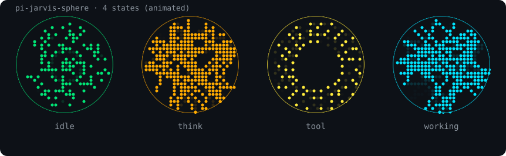

# pi-jarvis-sphere 🜄

[English](README.md) | [中文](README.zh.md)

Pi agent 的 **Jarvis 粒子球**:一个悬浮在 pi 终端右下角的粒子球浮层。它会根据 pi 的实时状态变化颜色与动画 -- 思考时琥珀色折射折线、调用工具时黄色顺时针粒子环、生成答案时青色快速折射、TTS 说话时脉冲,像一个小助手在"活"着。sub-agent 活动(通过 pi-subagents)也会像 tool 态一样让球动画。



*模拟四态动画(SMIL SVG,由真实渲染代码生成 -- 流场 / 折射 / 轨道粒子环)*

## ✨ 特性

- **四态动画**,颜色即状态:

  | 状态 | 颜色 | 动画 |
  | --- | --- | --- |
  | 空闲 | 绿色 `#00e676` | curl noise 流场(慢)+ 中心水波纹 |
  | 思考中 (thinking) | 琥珀色 `#ffab00` | 粒子折射(慢速折线,边界反射 + 内部随机折射) |
  | 工具调用 (tool) | 黄色 `#ffeb3b` | 均匀粒子环 **顺时针** — 中心留空,4 层 × 20 点(80 粒子),微分旋转:内慢外快 |
  | 生成答案 (working) | 青色 `#00E5FF` | 粒子折射(快速折线) |
  | sub-agent | 黄色(tool) | sub-agent 活动通过 `subagents:started` / `subagents:completed` / `subagents:failed` 信号复用 tool 动画 |
  | 减速 (wind-down) | 保持当前色 | 思考/工具/生成结束后的 1 秒 ease-out 减速,再回到空闲 |

- **TTS 说话联动**:pi-ext-tts-mimo 播放语音时,球体脉冲更密更快,像在说话(空闲态下 10FPS -> 30FPS)。
- **方向锚点**:流场顺时针/逆时针旋转,减速时保持方向可辨。
- **不抢键盘**:`nonCapturing` 浮层,打字、快捷键完全不受影响。
- **可开关**:`/jarvis` 命令切换,状态持久化到 `config.json`(默认开启)。
- **生命周期安全**:随 `session_start` 挂载、`session_shutdown` 清理;子 agent 会话不会重复挂载;`/reload` 不泄漏监听器。

## 📦 安装

```bash
# 1. 克隆/放到独立目录(与 ~/github 下其他 pi 扩展同约定)
git clone https://github.com/fan56/pi-jarvis-sphere.git ~/github/pi-jarvis-sphere

# 2. 符号链接到 pi 扩展目录(pi 自动发现 ~/.pi/agent/extensions/<name>)
ln -s ~/github/pi-jarvis-sphere ~/.pi/agent/extensions/pi-jarvis-sphere

# 3. 在 pi 里 /reload 即可生效
```

> 依赖(可选):`pi-ext-tts-mimo` 提供 `tts:started`/`tts:stopped` 信号,球体才能感知"正在说话"。没有它也照常工作,只是没有说话脉冲。

## 🎮 使用

| 命令 | 作用 |
|---|---|
| `/jarvis` | 切换球体显示/隐藏(状态写入 `config.json`) |

`config.json`(扩展目录下,默认):

```json
{ "enabled": true }
```

## 🧪 开发与调试

- 改完代码在 pi 里 `/reload` 即可热加载(jiti 直接跑 `.ts`,无构建步骤)。
- 语法检查:`node -e "…typescript.transpileModule…"`(无 tsc 构建)。
- 测试:派一个 `sleep N` 的子 agent,即可观察 sub-agent/tool 态(黄·顺时针涡流);正常问答可观察 think 态(琥珀·折射)。

## 🗺️ Roadmap

- [ ] V2:外部独立窗口(扩展内起本地 WebSocket + 浏览器,真 3D WebGL 粒子球)
- [ ] 思考等级联动颜色(off->max 热力阶梯色阶,曾实现后被三态色取代)
