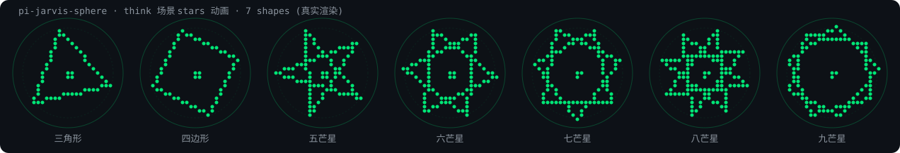

# pi-jarvis-sphere 🜄

[English](README.md) | [中文](README.zh.md)

Pi agent 的 **Jarvis 粒子球**:一个悬浮在 pi 终端右下角的粒子球浮层。它会根据 pi 的实时状态变化颜色与动画 -- 思考时琥珀色星形序列手绘、调用工具时黄色顺时针粒子环、生成答案时青色顺时针轨道粒子流、TTS 说话时脉冲,像一个小助手在"活"着。sub-agent 活动(通过 pi-subagents)也会像 tool 态一样让球动画。


*模拟四态动画(SMIL SVG,由真实渲染代码生成 -- 流场 / 折射 / 轨道粒子环)*

## ✨ 特性

- **四态动画**,颜色即状态:

  | 状态 | 颜色 | 动画 |
  | --- | --- | --- |
  | 空闲 | 绿色 `#00e676` | curl noise 流场(慢)+ 中心水波纹 |
  | 思考中 (thinking) | 琥珀色 `#ffab00` | 星形序列(7 形状循环手绘,固定逆时针) |
  | 工具调用 (tool) | 黄色 `#ffeb3b` | 均匀粒子环 **顺时针** — 中心留空,4 层 × 20 点(80 粒子),微分旋转:内慢外快 |
  | 生成答案 (working) | 青色 `#00E5FF` | 轨道粒子流(顺时针,与 tool 同款) |
  | sub-agent | 黄色(tool) | sub-agent 活动通过 `subagents:started` / `subagents:completed` / `subagents:failed` 信号复用 tool 动画 |
  | 减速 (wind-down) | 保持当前色 | 思考/工具/生成结束后的 1 秒 ease-out 减速,再回到空闲 |

- **TTS 说话联动**:pi-ext-tts-mimo 播放语音时,球体脉冲更密更快,像在说话(空闲态下 10FPS -> 30FPS)。
- **方向锚点**:流场顺时针/逆时针旋转,减速时保持方向可辨。
- **不抢键盘**:`nonCapturing` 浮层,打字、快捷键完全不受影响。
- **可开关**:`/jarvis` 命令切换,状态持久化到 `config.json`(默认开启)。
- **生命周期安全**:随 `session_start` 挂载、`session_shutdown` 清理;子 agent 会话不会重复挂载;`/reload` 不泄漏监听器。

## 📦 安装

### 方式 A — npm(推荐)

```bash
pi install npm:@aiwayds/pi-jarvis-sphere
```

### 方式 B — 源码

```bash
# 1. 克隆/放到独立目录(与 ~/github 下其他 pi 扩展同约定)
git clone https://github.com/fan56/pi-jarvis-sphere.git ~/github/pi-jarvis-sphere

# 2. 符号链接到 pi 扩展目录(pi 自动发现 ~/.pi/agent/extensions/<name>)
ln -s ~/github/pi-jarvis-sphere ~/.pi/agent/extensions/pi-jarvis-sphere

# 3. 在 pi 里 /reload 即可生效
```

> 依赖(可选):`pi-ext-tts-mimo` 提供 `tts:started`/`tts:stopped` 信号,球体才能感知"正在说话"。没有它也照常工作,只是没有说话脉冲。

## 🎮 使用

| 命令 | 作用 |
|---|---|
| `/jarvis` | 切换球体显示/隐藏(状态写入 `~/.pi/agent/pi-jarvis-sphere.json`) |

用户配置文件位于 agent 目录(首次 `/jarvis` 切换时创建),**可自由编辑**:

```json
{ "enabled": true }
```

> **配置优先级**:存在 `~/.pi/agent/pi-jarvis-sphere.json` 时优先读它;否则回退到包内
> 自带的 `config.json`(只读默认值)。包内文件永远不会被覆盖——`pi update` 不会丢你的设置。

## 🧩 动画插件化

每个动画是独立插件文件(闭包自持粒子状态),通过统一接口接入;**场景 → 动画的映射由 `config.json` 驱动,改配置即换动画,不用碰代码**。

```
animations/          # 动画插件目录(新增动画 = 建文件 + registry 登记一行)
  flow-field.ts      # 流场 + 水波纹(idle 默认)
  refract.ts         # 折射粒子
  stars.ts           # 星形序列(think 默认,7 形状循环手绘)
  orbital.ts         # 轨道粒子流(tool 默认)
  registry.ts        # 注册表:id -> 工厂
lib/                 # 共享层:类型 / 网格几何 / 盲文原语 / noise / 场景配置解析
config.json          # 你的可编辑"插件目录"
```

`config.json` 的 `scenes` 字段控制每个场景挂哪个动画、参数如何调:

```json
{
  "enabled": true,
  "scenes": {
    "idle":    { "animation": "flow-field", "params": { "fieldSpeed": 0.06, "dir": 1, "fieldCount": 120, "fieldScroll": 0.02 } },
    "think":   { "animation": "stars",    "params": { "starSpeed": 0.02, "cycleFrames": 160, "starSize": 0.82, "breathSpeed": 0.04 } },
    "tool":    { "animation": "orbital",  "params": { "spinSpeed": 0.15, "dir": 1 } },
    "working": { "animation": "orbital",  "params": { "spinSpeed": 0.15, "dir": 1 } }
  }
}
```

### stars —— think 场景默认动画

**think** 场景的默认动画:循环手绘 **7 个形状** —— 三角形 → 四边形 → 五芒星 → 六芒星 → 七芒星 → 八芒星 → 九芒星,由简入繁,每个形状逐边绘制,固定逆时针旋转。



*7 形状样例取自每个周期保持段中段帧,由真实渲染代码生成(含中心呼吸点)*

| 参数 | 含义 | 默认 |
| --- | --- | --- |
| `starSpeed` | 旋转速度(弧度/帧,正值=逆时针) | `0.02` |
| `cycleFrames` | 每形状周期帧数(前 40% 逐边绘制+放大,中 45% 完整保持,后 15% 收缩衔接) | `160` |
| `starSize` | 星形外接圆相对球半径的比例 | `0.82` |
| `starStep` | 星形跳点覆盖(`-1`=按形状表,正整数对 n 取模) | `-1` |
| `breathSpeed` | 中心点呼吸速度(`0.04` ≈ 2.6s 一次呼吸) | `0.04` |

> **中心点呼吸**:球心 2×2 点簇按正弦脉动(1 → 4 点点亮)。

**例:把"粒子流"(orbital)插到 think 场景**——只改一行 `config.json`:

```json
"think": { "animation": "orbital", "params": { "spinSpeed": 0.15, "dir": 1 } },
```

改完 `/reload` 生效。参数缺省时用插件自身 `defaults` 兜底;`dir` 控制旋转方向(`1`=顺时针 / `-1`=逆时针)。

> 注:think 与 working 是独立动画槽位,可分别配不同动画;同一动画在多个场景各自持有独立粒子实例(互不干扰)。**working** 与 **tool** 一样使用顺时针轨道粒子流(`dir: 1`)。

## 🧪 开发与调试

- 改完代码在 pi 里 `/reload` 即可热加载(jiti 直接跑 `.ts`,无构建步骤)。
- 语法检查:`node -e "…typescript.transpileModule…"`(无 tsc 构建)。
- 测试:派一个 `sleep N` 的子 agent,即可观察 sub-agent/tool 态(黄·顺时针涡流);正常问答可观察 think 态(琥珀·星形序列)。

## 🗺️ Roadmap

- [ ] V2:外部独立窗口(扩展内起本地 WebSocket + 浏览器,真 3D WebGL 粒子球)
- [ ] 思考等级联动颜色(off->max 热力阶梯色阶,曾实现后被三态色取代)

## 📜 Changelog

完整版本历史见 [CHANGELOG.md](CHANGELOG.md)。
